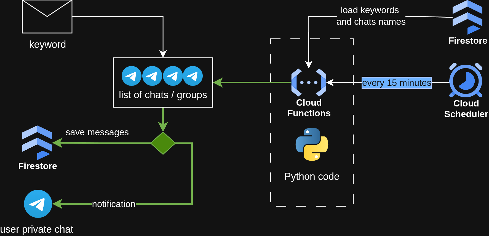

# Telegram Parser

> **Setup & operation:** see [documentation/INSTRUCTION.md](documentation/INSTRUCTION.md) for full
> installation, deployment, testing and troubleshooting.
> **Formal specification (real):** see [documentation/TRD.md](documentation/TRD.md).
> **Retrospective spec (AI reverse):** see [documentation/TRD_reverse.md](documentation/TRD_reverse.md).

## Overview

This project is a high-performance Telegram monitoring tool designed to listen to
specified public channels, search for defined keywords in real-time, and send alerts
when matches are found. It utilizes the [Telethon](https://docs.telethon.dev/en/stable/)
library for interacting with the Telegram API.

Key features:

- **Keyword Monitoring** — scans messages for specific keywords in real-time.
- **Firestore Message Archive** — every keyword-matched message is saved to Firestore for search and audit.
- **State Management** — tracks the last checked message ID per channel in Firestore (at-least-once, cursor saved after each chat).
- **Dynamic Configuration** — channel lists and keywords are managed in Firestore, no redeploy needed.
- **Secure** — credentials managed via Google Secret Manager.
- **Graceful Shutdown** — saves cursor state on `SIGINT`/`SIGTERM`, optional time limit to avoid flood blocks.
- **Health Monitoring** — Firestore heartbeat + `?health=1` endpoint + Cloud Logging alert policies.

## User Story

Many public Telegram channels publish time-sensitive information — announcements,
offers, alerts, market movements — but manually monitoring dozens of channels is
impractical. This tool answers a single focused question:
*"Did any of my target channels post something containing my keywords since the last
time I checked?"*

- **Define once, run forever** — set keywords and channel list in Firestore; the poller runs continuously.
- **Immediate, actionable alerts** — Telegram notification with a 300-character excerpt and a deep link to the original message.
- **Full audit trail** — every matched message is archived to Firestore for later review.

## Architecture

- **Language**: Python 3.12
- **Core Library**: Telethon (async Telegram client)
- **Infrastructure**: Google Cloud Functions (Gen 2), Firestore (config + state), Secret Manager, Cloud Scheduler (OIDC-authenticated HTTP trigger)

Deployed as a single Cloud Function, invoked by Cloud Scheduler on a schedule:
load config → poll channels (cursor-based) → match keywords → archive to Firestore → send Telegram alert → save cursor → write heartbeat.

## Documentation

- [documentation/INSTRUCTION.md](documentation/INSTRUCTION.md) — setup, deployment, testing, troubleshooting
- [documentation/TRD.md](documentation/TRD.md) — real TRD (source of truth, to be filled)
- [documentation/TRD_reverse.md](documentation/TRD_reverse.md) — AI reverse-engineered formal requirements (FR/NFR), data model, traceability matrix
- [documentation/config-manifest.md](documentation/config-manifest.md) — environment variables and configuration reference (real)
- [documentation/config-manifest_reverse.md](documentation/config-manifest_reverse.md) — AI reverse-engineered config manifest
